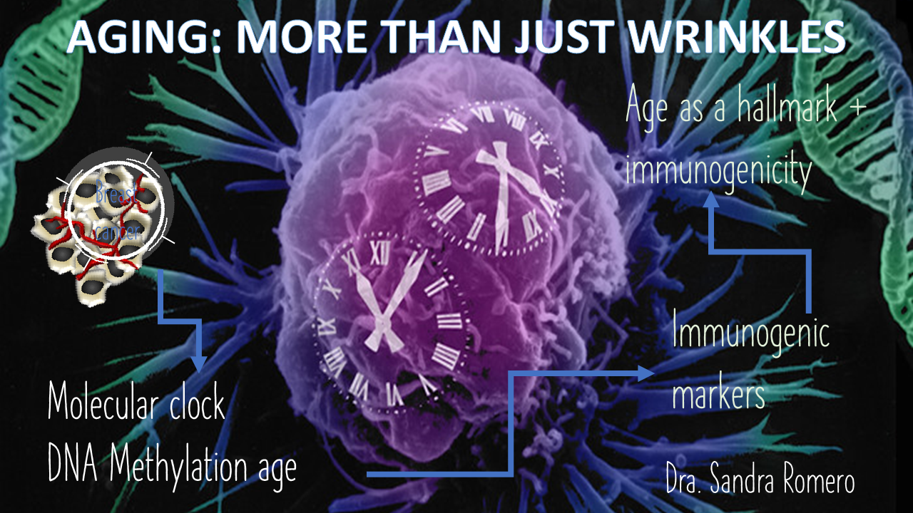
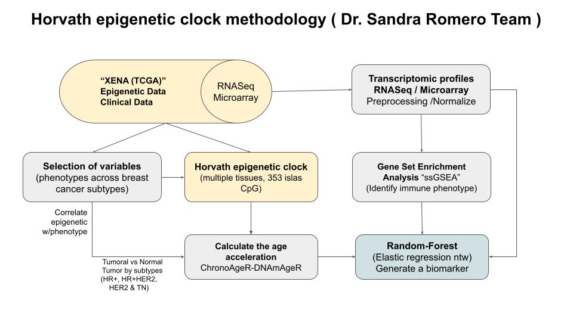
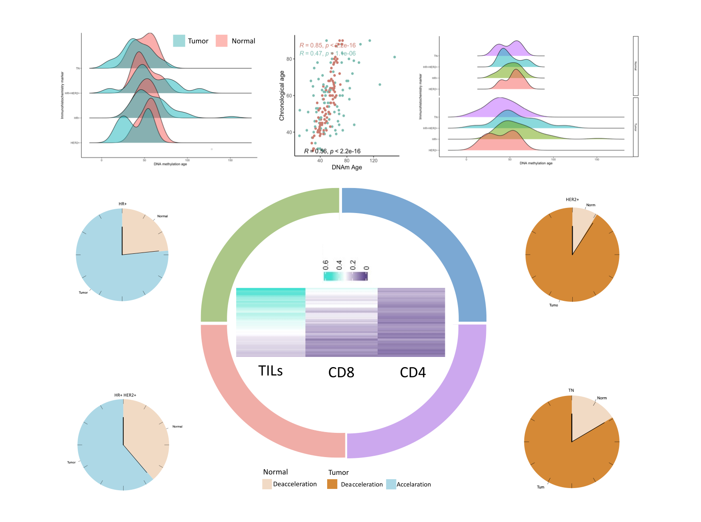
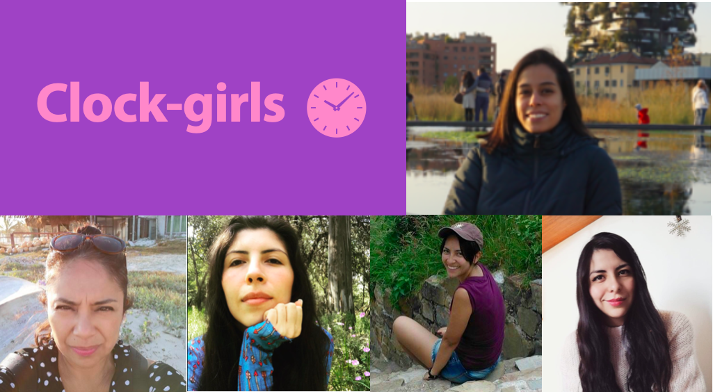

```{r setup, include=FALSE}
knitr::opts_chunk$set(echo = FALSE)
```

## Introduction: BRCA and EpiClocks
```{r, fig.align="center", out.width= "95%", out.height= "95%"}

```


## What we did
```{r, fig.align="center", out.width= "95%", out.height= "95%"}

```

## Integrative figure
```{r, fig.align="center", out.width= "95%", out.height= "95%"}

```

## *Thank you very much!* 
```{r, fig.align="center", out.width= "95%", out.height= "95%"}

```


